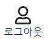

# navbar 만들기


- 화면 상단에 네비게이션 바를 만들고 전체, 여성, 남성, 아동, 유아 탭으로 카테고리를 분류하고, 오른쪽에는 검색, 로그인, 장바구니 태그를 만들었습니다.

# 로그인 페이지 만들기




- 리액트 라우터로 로그인 페이지를 main 부분에 로드 되도록 생성했습니다.

```
  const [authenticate, setAuthenticate] = useState(false);
```

- 연습용 페이지이기 때문에 authenticate 라는 state를 이용해 로그인 전 후 화면을 구분하기로 했습니다.
