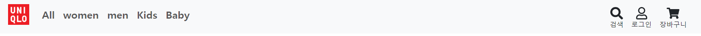
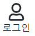

# navbar 만들기



- 화면 상단에 네비게이션 바를 만들고 전체, 여성, 남성, 아동, 유아 탭으로 카테고리를 분류하고, 오른쪽에는 검색, 로그인, 장바구니 태그를 만들었습니다.

# 로그인 페이지 만들기




- 리액트 라우터로 로그인 페이지를 main 부분에 로드 되도록 생성했습니다.

```
  const [authenticate, setAuthenticate] = useState(false);
```

- 연습용 페이지이기 때문에 authenticate 라는 state를 이용해 로그인 전 후 화면을 구분하기로 했습니다.

# redux

- 사용이유 : 컴포넌트간 state공유를 위해


1. https://redux-toolkit.js.org/introduction/getting-started

- npm install @reduxjs/toolkit
- npm install react-redux
- store.js 파일생성

```
import { configureStore } from "@reduxjs/toolkit";

export default configureStore({
  reducer: {},
});
```

```
createSlice({
  name: "state이름",
  initialState: "값",
});
```

- index.js에 provider 호출

```
  <Provider store={store}>
    <BrowserRouter>
      <App />
    </BrowserRouter>
  </Provider>
```

# 장바구니 페이지 만들기


- redux-toolkit 라이브러리 사용해서 장바구니 페이지를 만들었습니다
- 유저는 본인이 장바구니에 담은 상품들을 확인하고 수량을 추가 제거 하여 조절 할 수 있습니다
- detail 페이지에서 추가된 장바구니 상품은 store.js 파일의 배열 함수에 저장됩니다. 그 저장된 데이터를 redux 라이브러리 배열 변경 함수로 dispatch로 배열 안 객체의 count(수량) 값을 수정해주는 기능입니다.
